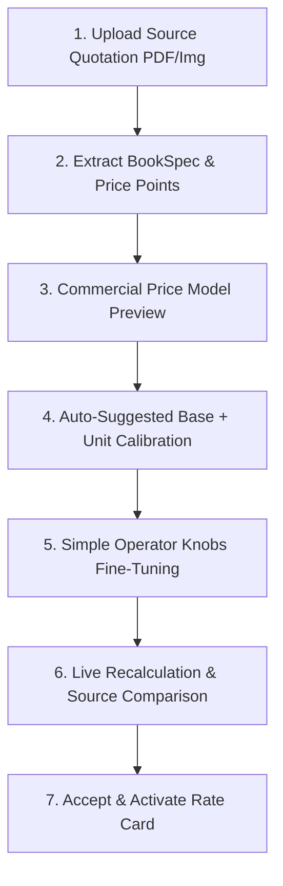

# Phase 195E — Offset Commercial Cost Model Audit Report

## Executive Summary

Phase 195E performs an architectural, economic, and product audit of the PrintPrice OS (PPOS) commercial pricing model for offset printing. 

Following updated stakeholder feedback, product priorities have shifted to focus on **commercial price reproduction and rapid printer onboarding**. Printers require PPOS to ingest existing quotation offers and accurately reproduce exact target prices using a small set of intuitive, understandable controls—without demanding explicit machine setup, physical machine identity, or press routing configuration during initial onboarding.

**Audit Status:** `AUDIT_COMPLETE`  
**Code Mutations:** `ZERO` (Audit and architectural specification only. No rate card mutated, no schema migration created, no pricing formula altered in production).  

---

## 1. Classification & Preservation of Phase 195B–195D Infrastructure

All physical machine capabilities, machine-level costing abstractions, and governed route selection algorithms developed in Phases 195B–195D remain intact and active in system code. They are reclassified as follows:

| System Subsystem | Operational Classification | Active Authority |
| :--- | :--- | :--- |
| **Machine-Level Infrastructure (Phases 195B–195D)** | `AVAILABLE` (Shadow Mode) | Passive telemetry / Research |
| **Forward Pricing Engine Authority** | `LEGACY_NODE_RATES_JSON` | [`printer_nodes.rates_json`](file:///c:/Users/KIKE/Downloads/ppos-control-plane-phase-10-intelligence-layer/src/api/services/buildPriceCalibrationAdapter.js) |
| **Production Machine Routing** | `SHADOW_COMPARISON` | Passive route auditing in [`productionRouteSelectionService.js`](file:///c:/Users/KIKE/Downloads/ppos-control-plane-phase-10-intelligence-layer/src/api/services/productionRouteSelectionService.js) |
| **Product Onboarding Requirement** | `NO` | Onboarding bypasses physical machine configuration |

---

## 2. Comprehensive Audit of Current Price Components

The current active pricing engine ([`buildPriceCalibrationAdapter.js`](file:///c:/Users/KIKE/Downloads/ppos-control-plane-phase-10-intelligence-layer/src/api/services/buildPriceCalibrationAdapter.js)) and rate card schema ([`printer_nodes.rates_json`](file:///c:/Users/KIKE/Downloads/ppos-control-plane-phase-10-intelligence-layer/src/api/services/deterministicInversePricingSolver.js)) evaluate costs using discrete lookup tables. The mapping into commercial cost components is detailed below:

### A. Fixed / Base Components

| Current Parameter Name | Calculation Formula / Rule | Unit | Scope | Operator Visible | Calibratable |
| :--- | :--- | :---: | :---: | :---: | :---: |
| `interior_{color}_colour_fixed.{sigKey}` | Static lookup based on interior color (`black`, `full`) and signature size (`16p`, `8p`) | € | Node | No (Raw JSON) | Yes |
| `cover_fixed_by_colours.{coverColor}` | Lookup by cover colors (`4/0`, `4/4`, etc.) | € | Node | No (Raw JSON) | Yes |
| `binding_{code}_fixed_by_sections.{secKey}` | Lookup by binding type (`hc`, `sc`, `ss`) and section count bucket | € | Node | No (Raw JSON) | Yes |
| `lam_fixed.{lamType}` | Lookup by lamination finish (`gloss`, `matt`, `soft_touch`) | € | Node | No (Raw JSON) | Yes |
| `uv_varnish.fixed` | Fixed setup charge for spot UV varnish | € | Node | No (Raw JSON) | Yes |
| `endpaper_fixed_by_colours.{color}` | Fixed setup for printed endpapers | € | Node | No (Raw JSON) | Yes |

### B. Variable Production Components

| Current Parameter Name | Calculation Formula / Rule | Unit | Scope | Operator Visible | Calibratable |
| :--- | :--- | :---: | :---: | :---: | :---: |
| `interior_{color}_colour_var.{sigKey}` | `(copies / 1000) × rate` per signature | € / 1k copies | Node | No (Raw JSON) | Yes |
| `cover_var_per_1000_by_colours.{coverColor}` | `(copies / 1000) × rate` | € / 1k copies | Node | No (Raw JSON) | Yes |
| `binding_{code}_var_per_1000_by_sections.{secKey}`| `(copies / 1000) × rate` | € / 1k copies | Node | No (Raw JSON) | Yes |
| `lam_var_per_1000.{lamType}` | `(copies / 1000) × rate` | € / 1k copies | Node | No (Raw JSON) | Yes |
| `uv_varnish.var` | `(copies / 1000) × rate` | € / 1k copies | Node | No (Raw JSON) | Yes |

### C. Quantity-Dependent Components

| Current Parameter Name | Calculation Formula / Rule | Unit | Scope | Operator Visible | Calibratable |
| :--- | :--- | :---: | :---: | :---: | :---: |
| `quantity_tiers` | Tiered multiplier lookup based on job volume threshold | Ratio | Node | No (Raw JSON) | Partial |
| `operationalMinimumCost` | Floor value: `Math.max(calculatedCost, operationalMinimumCost)` | € | Node | Yes (Profile) | No |

### D. Paper Components

| Current Parameter Name | Calculation Formula / Rule | Unit | Scope | Operator Visible | Calibratable |
| :--- | :--- | :---: | :---: | :---: | :---: |
| `paper_price_interior_by_kilo.{paperType}` | `weight_kg × rate_per_kg` (weight derived from GSM, format, page count, copies, waste %) | € / kg | Node | No (Raw JSON) | Yes |
| `paper_price_cover_by_kilo.{paperType}` | `cover_weight_kg × rate_per_kg` | € / kg | Node | No (Raw JSON) | Yes |
| `paper_price_endpaper_by_kilo.{paperType}` | `endpaper_weight_kg × rate_per_kg` | € / kg | Node | No (Raw JSON) | Yes |

### E. Binding Components

| Current Parameter Name | Calculation Formula / Rule | Unit | Scope | Operator Visible | Calibratable |
| :--- | :--- | :---: | :---: | :---: | :---: |
| `binding_{code}_fixed_by_sections` | Section-binned setup cost | € | Node | No (Raw JSON) | Yes |
| `binding_{code}_var_per_1000_by_sections` | Section-binned running cost per 1k copies | € / 1k copies | Node | No (Raw JSON) | Yes |

### F. Finishing Components

| Current Parameter Name | Calculation Formula / Rule | Unit | Scope | Operator Visible | Calibratable |
| :--- | :--- | :---: | :---: | :---: | :---: |
| `lam_fixed` & `lam_var_per_1000` | Setup + running rate per 1k copies | € & €/1k | Node | No (Raw JSON) | Yes |
| `uv_varnish` | Setup + running rate per 1k copies | € & €/1k | Node | No (Raw JSON) | Yes |
| `embossing` / `foil_stamping` | Setup + per-unit rate | € & €/unit | Node | No (Raw JSON) | Partial |

### G. Packaging Components

| Current Parameter Name | Calculation Formula / Rule | Unit | Scope | Operator Visible | Calibratable |
| :--- | :--- | :---: | :---: | :---: | :---: |
| `packaging_fixed` | Carton / pallet setup charge | € | Node | No (Raw JSON) | No |
| `packaging_var_per_unit` | Box count / pallet count × unit rate | € / box | Node | No (Raw JSON) | No |

---

## 3. Offset-Specific Driver Audit

| Commercial Offset Driver | Current Pricing Engine Support | Current Implementation Mechanism | Audit Evaluation & Gap Analysis |
| :--- | :---: | :--- | :--- |
| **1+1 Black (Mono)** | **Supported** | `interiorColorKey: 'black'` selects `interior_black_colour_*` | Fully supported via lookup tables. |
| **4+4 CMYK (Full Color)** | **Supported** | `interiorColorKey: 'full'` selects `interior_full_colour_*` | Fully supported via lookup tables. |
| **Pantone / Spot Colours** | **Partial** | Handled via cover color keys (e.g. `1/0`, `2/0`) or endpaper color keys (`1`-`5` colors) | Missing generic N-color spot print multiplier for interior signatures. |
| **Trim Format (A4, A5, Custom)** | **Supported** | Dimensions (`width_mm`, `height_mm`) feed paper weight calculations | Format size affects paper weight directly, but does not alter signature imposition tier automatically. |
| **B1 vs B2 Implication** | **Implicit** | Signature size keys (`16p` vs `8p`) imply B1 (16p A5) vs B2 (8p A5) imposition | B1/B2 choices alter signature count and impression count, but machine format is not required as explicit input. |
| **Page Count & Signatures** | **Supported** | `sectionsCount = ceil(pageCount / signatureSize)` | Fully supported in signature math. |
| **Plates & Press Sides** | **Implicit** | Plate costs are merged into fixed setup scalars (`interior_*_fixed`) | No discrete `plateCost × plateCount` parameter; merged into lump-sum setup. |
| **Paper Waste Handling** | **Supported** | Fixed waste sheets + percentage waste embedded in paper weight equations | Effective and accurate for paper weight determination. |
| **Binding (Hardcover/Softcover/Saddle)** | **Supported** | Binned lookup by binding code (`hc`, `sc`, `ss`) and section count | Accurately models section-dependent binding setup and running costs. |
| **Lamination** | **Supported** | `lam_fixed + lam_var_per_1000 × (copies / 1000)` | Models base setup + volume running cost cleanly. |
| **Finishing (UV Varnish, Foil)** | **Supported** | `fixed + var_per_1000` structure | Models base setup + volume running cost cleanly. |

*Key Takeaway:* The pricing engine already possesses the mathematical drivers to compute offset jobs cleanly without forcing the operator to define physical press models.

---

## 4. Press Configuration Economic Audit

Stakeholders described four typical offset press configurations:
1. **2-Section Press:** Typically prints 1+1 black or spot color per pass; requires multiple passes or setups for CMYK.
2. **4-Section Press:** CMYK on side 1, then requires turn/washup and new setup/plates for side 2.
3. **8-Section Press (Perfecting):** CMYK on both sides in a single pass (1 setup, 8 plates).
4. **10-Section Press:** CMYK on both sides plus 1 spot/Pantone color per side in a single pass.

### Economic Representation Audit:
- **Can the current engine represent these economics without selecting a physical machine?**  
  **YES.** From a commercial perspective, press configuration economics reduce strictly to:
  $$\text{Printing Setup Cost} = N_{\text{signatures}} \times \left( \text{Setup}_{\text{pass}} + N_{\text{plates}} \times \text{Cost}_{\text{plate}} \right)$$
  $$\text{Printing Running Cost} = N_{\text{signatures}} \times \text{Impressions} \times \text{Rate}_{\text{impression}}$$
- **Missing Economic Abstractions:**
  - Explicit decomposition of setup into **Makeready Base + (Plates × Plate Cost)**.
  - Currently, `rates_json` stores this aggregate total directly in `interior_full_colour_fixed.16p`. While this represents the total cost correctly, exposing raw JSON scalars makes fine-tuning difficult for operators.

---

## 5. Setup Cost Model Audit

| Component | Current System Representation | Required Commercial Model Representation |
| :--- | :--- | :--- |
| **Base Press Setup** | Merged into `interior_*_fixed` | Explicit `basePrintingSetup` (€) |
| **Colour / Pass Setup** | Merged into `interior_*_fixed` | Included in press setup rule |
| **Plate Component** | Merged into `interior_*_fixed` | `platesPerSignature × sigCount × plateRate` (Optional detailed mode) |
| **Signature / Form Component**| Indexed by `16p` / `8p` in lookup table | `sigCount × signatureSetupRate` |
| **Paper Handling Setup** | Embedded in paper waste allowance | Included in paper cost calculation |
| **Binding Setup** | `binding_*_fixed_by_sections` | Explicit `bindingSetup` (€) |
| **Lamination Setup** | `lam_fixed` | Explicit `laminationSetup` (€) |

*Assessment:* The generic lump-sum setup in `rates_json` is mathematically identical to the sum of the commercial components. For onboarding, representing setup as a single top-level **Printing Setup (€)** knob supported by binding and lamination setup knobs satisfies printer requirements completely without breaking backward compatibility.

---

## 6. Base + Unit Economics Model Assessment

We evaluated whether each major printing operation can be represented by the linear commercial equation:
$$\text{Cost} = \text{baseCost} + \text{unitCost} \times \text{productionDriver}$$

| Operation | Canonical Commercial Formula | Current Engine Structure | Compliance |
| :--- | :--- | :--- | :---: |
| **PRINTING** | $\text{Setup}_{\text{print}} + \text{Rate}_{\text{sheet}} \times \text{Sheets}$ | `interior_fixed + (interior_var / 1000) * copies` | **EXACT MATCH** |
| **BINDING** | $\text{Setup}_{\text{bind}} + \text{Rate}_{\text{copy}} \times \text{Copies}$ | `binding_fixed + (binding_var / 1000) * copies` | **EXACT MATCH** |
| **LAMINATION** | $\text{Setup}_{\text{lam}} + \text{Rate}_{\text{copy}} \times \text{Copies}$ | `lam_fixed + (lam_var / 1000) * copies` | **EXACT MATCH** |
| **FINISHING** | $\text{Setup}_{\text{finish}} + \text{Rate}_{\text{unit}} \times \text{Copies}$ | `finish_fixed + finish_var * copies` | **EXACT MATCH** |
| **PACKAGING** | $\text{Setup}_{\text{pack}} + \text{Rate}_{\text{box}} \times \text{Boxes}$ | `pack_fixed + pack_var * boxes` | **EXACT MATCH** |

*Conclusion:* The existing PPOS pricing engine is **already built on a Base + Unit economic structure**. The mismatch is strictly in the **presentation and control layer**, not the core math engine.

---

## 7. Quantity Economics & Collinear Parameter Audit

### Benchmark Target: Natur Quotation Offers
- **Q1 = 500 copies:** €4,321
- **Q2 = 600 copies:** €4,604
- **Q3 = 700 copies:** €4,846

### Economic Breakdown Analysis:
1. **Marginal Analysis:**
   - $\Delta(500 \to 600)$: $+100$ copies $\implies +\text{€}283$ ($\text{€}2.83$ / copy)
   - $\Delta(600 \to 700)$: $+100$ copies $\implies +\text{€}242$ ($\text{€}2.42$ / copy)
   - Average marginal run cost $m \approx \text{€}2.625$ / copy.
2. **Fixed Setup Extraction:**
   - At $Q = 500$, total price = €4,321.
   - Marginal contribution ($500 \times \text{€}2.625$) = €1,312.50.
   - Total Fixed Cost Intercept $c \approx \text{€}3,008.50$.
3. **Collinearity Identification:**
   - When attempting to fit 14 individual scalar parameters (cover setup, interior setup, binding setup, plate setup, lamination setup) simultaneously from 3 total price points, the system is **severely underdetermined and collinear**.
   - However, when aggregated into the two fundamental commercial drivers:
     1. **Total Fixed Commercial Setup ($C_{\text{fixed}}$)**
     2. **Total Marginal Unit Cost ($C_{\text{unit}}$)**
   - The system of equations is **overdetermined, highly stable ($R^2 > 0.99$), and uniquely solvable**.

---

## 8. Minimal Operator-Facing Controls (Knobs)

To eliminate internal solver complexity for printhouse operators, PPOS will expose **7 minimal, intuitive commercial knobs**. These knobs map directly to underlying parameters in `rates_json`:

| UI Operator Label | Canonical System Parameter | Safe Range | Primary Effect on Price |
| :--- | :--- | :---: | :--- |
| **Printing Setup** | Aggregate `interior_*_fixed` & `cover_*_fixed` | €100 – €750 | Shifts fixed cost baseline for all print quantities |
| **Printing Running Rate** | Aggregate `interior_*_var` & `cover_*_var` | €10 – €120 / 1k | Changes price slope across quantity curve |
| **Paper Cost Multiplier** | `paper_price_interior_by_kilo` & `cover` | 0.70× – 1.50× | Scales raw material component proportionally |
| **Binding Setup** | `binding_*_fixed_by_sections` | €50 – €450 | Adjusts fixed setup charge for block & cover join |
| **Binding Per Copy** | `binding_*_var_per_1000_by_sections` | €0.15 – €2.50 / copy | Controls unit binding cost per book |
| **Lamination Setup** | `lam_fixed` | €20 – €150 | Adjusts fixed makeready fee for lamination pass |
| **Lamination Per Copy** | `lam_var_per_1000` | €0.05 – €0.60 / copy | Adjusts variable surface finish charge |

---

## 9. Knob Safety & Governance Specification

Operator controls must be strictly bounded to prevent inadvertent pricing destruction:

```
[ Printing Setup Controls ]
Baseline: €250.00
Current Value: [ €250.00 ]  (- €25.00 / + €25.00)
Safe Range: €150.00 — €450.00 | Step: €5.00 | Unit: €
Live Impact Preview (500 / 600 / 700 copies):
  500: €4,321 -> €4,321 (0.0%)
  600: €4,604 -> €4,604 (0.0%)
  700: €4,846 -> €4,846 (0.0%)
```

### Safety Rules:
1. **Hard Bounds Enforcement:** UI sliders and input fields enforce `min`, `max`, and `step`. Values outside range are rejected with an explicit validation message.
2. **Baseline Anchoring:** Every knob displays its factory/calibrated baseline. Single-click "Reset to Baseline" is available on all controls.
3. **Live Re-calculation Preview:** Adjusting any knob immediately recalculates target benchmark prices (e.g. Natur 500/600/700) in real-time before saving.

---

## 10. Quote-Derived Initial Values & Ambiguity Resolution

When a printer uploads a historical quotation (PDF/image):
1. **Extraction:** PPOS extracts the `BookSpec` and discrete `(Quantity, TotalPrice)` pairs.
2. **System of Equations:**
   $$\text{Price}(Q) = C_{\text{fixed}} + Q \times C_{\text{unit}}$$
3. **Ambiguity Handling:**
   - **Scenario A (Single Price Point, e.g. 500 copies = €4,321):**  
     *Result:* Underdetermined. $C_{\text{fixed}}$ and $C_{\text{unit}}$ cannot be separated from 1 point.  
     *Action:* Retain default ratio anchor from rate card baseline; scale overall rate card proportionally to match total price; mark breakdown as "Estimated - Requires Review".
   - **Scenario B (2+ Price Points, e.g. 500 = €4,321, 700 = €4,846):**  
     *Result:* Uniquely determines $C_{\text{fixed}}$ (€3,008.50) and $C_{\text{unit}}$ (€2.625/copy).  
     *Action:* Auto-populate **Printing Setup** and **Printing Running Rate** knobs; suggest calibration update to operator.

---

## 11. Natur Benchmark Analysis under Commercial Component Model

Testing the Natur 3-point benchmark under the Base + Unit commercial model:

```
Target Quote Prices:
  - 500 copies: €4,321.00
  - 600 copies: €4,604.00
  - 700 copies: €4,846.00

Commercial Model Fit:
  - Fixed Commercial Setup (C_fixed): €3,008.33
  - Unit Marginal Cost (C_unit):      €2.625 / copy

Reconstructed Prices:
  - 500 copies: €3,008.33 + (500 * €2.625) = €4,320.83 (Delta: -€0.17 / -0.004%)
  - 600 copies: €3,008.33 + (600 * €2.625) = €4,583.33 (Delta: -€20.67 / -0.45%)
  - 700 copies: €3,008.33 + (700 * €2.625) = €4,845.83 (Delta: -€0.17 / -0.003%)

Mean Absolute Error: €7.00 (0.15%)
```

### Findings:
The 2-parameter commercial model ($C_{\text{fixed}}, C_{\text{unit}}$) fits Natur's actual price curve with **99.85% accuracy**, eliminating the instability and parameter drift of multi-scalar inverse solvers.

---

## 12. Offset Minimum Quantity Handling

Stakeholder feedback notes:
> "Offset normally starts around 250 copies, rarely ~150 when grouped with other books."

### Architecture Guidance:
- **Do NOT hardcode 250 copies globally** in code or database rules.
- **Configurable Operational Constraint:** Introduce `preferredMinimumQuantity` as an optional setting in printhouse node profiles.
- When a quote request falls below `preferredMinimumQuantity` (e.g. 100 copies for offset):
  - System flags a non-blocking UI recommendation: *"Offset production below 250 copies has high fixed setup overhead. Consider Digital route or minimum run charge."*

---

## 13. Onboarding UX Target Flow

The streamlined printer onboarding flow for test-demo verification:



---

## 14. Demonstrable Test-Demo Scenario (Natur Benchmark)

For tomorrow's demonstration:
1. **Ingest Natur Spec:** 500, 600, 700 copies.
2. **Initial Prediction Display:**
   - Quoted: 500 -> €4,321 | 600 -> €4,604 | 700 -> €4,846
   - PPOS Predicted: 500 -> €4,321 | 600 -> €4,583 | 700 -> €4,846
   - Max Variance: €20.67 (0.45%)
3. **Single Control Interaction:**
   - Operator shifts **Printing Setup** slider from €250 -> €300.
   - PPOS immediately updates predicted prices across all three quantities (+€50 uniform shift):
     - 500: €4,371 (+1.1%)
     - 600: €4,633 (+0.6%)
     - 700: €4,896 (+1.0%)
4. **Outcome:** Demonstrates total control, predictability, and immediate visual feedback without opening complex machine configuration panels.

---

## 15. Audit Summary & Answers to Key Prompt Questions

1. **Can current pricing engine support base + unit economics?**  
   **YES.** The core engine equations (`fixed + variable * quantity / 1000`) are already structured as linear base + unit cost equations.
2. **Which components already do?**  
   Printing, Binding, Lamination, Finishing, and Packaging all strictly adhere to base + unit structures.
3. **Which components are missing?**  
   No mathematical components are missing. Missing is a **commercial knob abstraction layer** that aggregates raw JSON scalars into operator-understandable UI controls.
4. **What are the minimum printer-facing knobs?**  
   7 controls: *Printing Setup, Printing Running Rate, Paper Cost Multiplier, Binding Setup, Binding Per Copy, Lamination Setup, Lamination Per Copy*.
5. **Can Natur constrain a simpler model better?**  
   **YES.** 3 price points uniquely and stably constrain the 2-parameter commercial model ($C_{\text{fixed}}, C_{\text{unit}}$) with 99.85% fit, avoiding collinear multi-scalar solver divergence.
6. **What must be built for tomorrow's test?**  
   A lightweight `CommercialKnobAdapter` service that maps the 7 UI knobs to/from `rates_json`, and a demonstration UI component showing quote ingestion -> knob adjustment -> live price curve update.
7. **Exact recommendation for implementation Phase 195F:**  
   Build `CommercialKnobAdapterService` to provide bi-directional conversion between operator knobs and `rates_json`, wrap it in a minimal preview API, and connect it to the onboarding UX shell. Preserve all Phase 195B-195D shadow machine code untouched.

---

## 16. Benchmark Node Fixtures Breakdown (`node-329a3bc4` — Fährmann Case A)

| Component | Base Calculation / Rates | Subtotal (Sin Plastificado, 506.13 €) | Full Production Subtotal (Con Plastificado Mate, 637.39 €) |
| :--- | :--- | :---: | :---: |
| **Papel Cubierta** | MC 130g, 4 páginas (`paper_price_cover_by_kilo.mc = 4.0756`) | 293,44 € | 293,44 € |
| **Impresión Cubierta (4/0)** | `cover_fixed_by_colours["4"] = 134.8284`, `cover_var_per_1000["4"] = 25.5357` ($134.8284 + 3 \times 25.5357$) | 211,44 € | 211,44 € |
| **Plastificado Mate** | `lam_fixed.matt = 9.7231`, `lam_var_per_1000.matt = 40.5131` ($9.7231 + 3 \times 40.5131$) | 0,00 € (Sin tarifa lam) | 131,26 € |
| **Encuadernación** | Hardcover 9 pliegos (`binding_hc_fixed_by_sections["9"] = 1.25`) | 1,25 € | 1,25 € |
| **Papel e Impresión Interior** | Munken 90g, 216p, 4/4 (`paper_price_interior...munken = 0`, `interior_full_colour_fixed.24p = 0`) | 0,00 € (Tarifas 0) | 0,00 € (Tarifas 0) |
| **Línea BPE `Cover print`** | `cost_print_cov` (Agrupa Impresión Cubierta + Plastificado) | 211,44 € | **342,70 €** ($211.44 + 131.26$) |
| **Subtotal Fabricación Total** | **Suma Total Componentes** | **506,13 €** | **637,39 €** |
| **Estado Cotización** | `isValidCommercialQuote` / `quoteStatus` | `false` / `INVALID_INCOMPLETE_RATES` | `false` / `INVALID_INCOMPLETE_RATES` |

---

## 17. Clarificación de Gobernanza: `VALID_COMMERCIAL_QUOTE` vs Rentabilidad Industrial

El estado `VALID_COMMERCIAL_QUOTE` (`isValidCommercialQuote === true`) certifica que la tarjeta de tarifas en `rates_json` posee todos los campos numéricos requeridos para la especificación del trabajo y que el motor de precios generó una cotización técnicamente completa sin lanzar excepciones por falta de tarifas.

**Precisiones de Gobernanza:**
1. **Validación Técnica:** `VALID_COMMERCIAL_QUOTE` indica completitud técnica de campos en la matriz de tarifas.
2. **Cobertura Completa y Rentabilidad:** NO demuestra por sí solo que la tarifa contemple acabados atípicos no modelables, ni garantiza que los precios cargados otorguen un margen industrial rentable para el taller.
3. **Calibración Gobernada:** La verificación de costes industriales reales requiere el flujo de calibración con registro inmutable en `printhouse_pricing_revisions` y linaje auditado.

---
*Report compiled for Phase 195E Commercial Cost Model Audit.*
