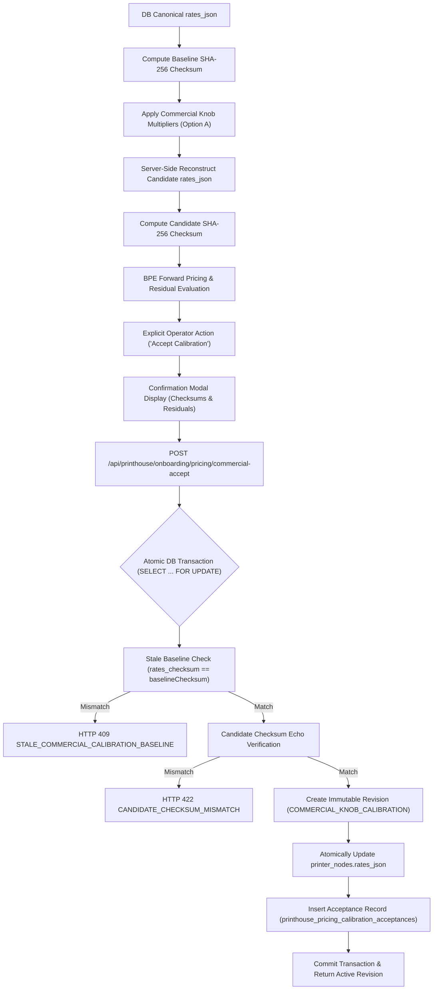

# PHASE 195G — Governed Commercial Calibration Acceptance

## Executive Summary

Phase 195G establishes the governed acceptance pipeline that converts a reviewed commercial calibration preview into an immutable, active pricing revision. This implementation strictly maintains `printer_nodes.rates_json` as the single canonical pricing authority and preserves all Phase 195B–195D machine-level costing infrastructure in **SHADOW_ONLY** mode.

---

## 1. Governance Chain & Lifecycle



---

## 2. Server-Side Candidate Reconstruction & Single Pricing Authority

1. **No Client-Supplied Rates:**
   - REST endpoints reject client-injected `baselineRates` or trusted `candidateRates`.
   - Baseline rates are strictly loaded from `printer_nodes.rates_json` using authenticated `tenantId` & `printerNodeId`.
2. **Reconstruction Algorithm:**
   - Server fetches current DB `rates_json`.
   - Server computes `currentBaselineChecksum = computeRatesChecksum(currentBaselineRates)`.
   - Server applies bounded commercial multipliers (`commercialKnobService.applyKnobAdjustments`).
   - Server recomputes `candidateRatesChecksum = computeRatesChecksum(candidateRates)`.
3. **Candidate Checksum Validation:**
   - If client echoes a candidate checksum that does not match server-recomputed candidate checksum, request is rejected with **HTTP 422 `CANDIDATE_CHECKSUM_MISMATCH`**.

---

## 3. Stale Baseline Protection & Concurrent Proposals

- **Stale Baseline Check:**
  ```javascript
  if (currentBaselineChecksum !== baselineRatesChecksum) {
      const err = new Error('STALE_COMMERCIAL_CALIBRATION_BASELINE');
      err.statusCode = 409;
      throw err;
  }
  ```
- **Concurrency Scenario:**
  - If Proposal A and Proposal B are created against Baseline X:
  - Acceptance of Proposal A updates `printer_nodes.rates_json` to Checksum Y.
  - Subsequent acceptance attempt of Proposal B detects `currentBaselineChecksum (Y) != proposal.baselineRatesChecksum (X)` and rejects with **HTTP 409 `STALE_COMMERCIAL_CALIBRATION_BASELINE`**.
  - Operator must regenerate proposal against current active baseline Y.

---

## 4. Transaction Isolation & Idempotency

- **Atomic DB Boundary (`SELECT ... FOR UPDATE`):**
  - Row locking on target `printer_nodes` record prevents race conditions.
  - Transactions encompass:
    1. Row locking & baseline checksum verification.
    2. Candidate checksum verification & residual evaluation.
    3. Insertion into `printhouse_pricing_revisions` (`source_type: 'COMMERCIAL_KNOB_CALIBRATION'`).
    4. Atomic update of `printer_nodes.rates_json` to candidate rates.
    5. Insertion into `printhouse_pricing_calibration_acceptances` (`acceptance_mode: 'EVIDENCE_CALIBRATED'` or `'OPERATOR_ADJUSTED'`).
- **Idempotency:**
  - Duplicate acceptance calls with identical parameters check for an existing active revision with `rates_checksum === candidateRatesChecksum`.
  - Returns the existing revision idempotently without creating duplicate revision or acceptance records.

---

## 5. UI Integration & Confirmation Modal

- **Zero-Mutation Preview:**
  - `CommercialCalibrationPanel.tsx` displays preview metrics with `NOT ACTIVE` status banner.
  - Adjusting sliders recalculates in-memory candidate rates without persisting changes to the DB.
- **Explicit Confirmation Flow:**
  - Clicking **"Accept Calibration"** opens `CommercialAcceptanceModal.tsx`.
  - Displays Printer Node, Baseline SHA-256 (short form), Candidate SHA-256 (short form), applied adjustments list, MAE/MAPE residual metrics, and explicit governance warning.
  - Explicit operator confirmation triggers POST to `/api/printhouse/onboarding/pricing/commercial-accept`.
  - Successful acceptance reloads active DB pricing and updates Hawk-Eye status.

---

## 6. Hawk-Eye Governance & Lineage Transparency

- Hawk-Eye exposes:
  - **Active Revision Source:** `Commercial Calibration` (`COMMERCIAL_KNOB_CALIBRATION`).
  - **Acceptance Mode:** `EVIDENCE_CALIBRATED` (if backed by quote evidence) or `OPERATOR_ADJUSTED` (manual).
  - **Active Checksum:** Matching `printer_nodes.rates_json` SHA-256 checksum.
  - **Lineage Metadata:** Preserves baseline SHA-256, candidate SHA-256, quote evidence refs, residuals (MAE/MAPE), and non-linear curvature flags (`curvatureDetected`).

---

## 7. Relationship to Machine Shadow Infrastructure

- Machine profiles (`printer_machines`), machine costing profiles (`machine_pricing_profiles`), and route rules (`printhouse_route_rules`) remain 100% untouched.
- Forward pricing authority remains strictly `printer_nodes.rates_json`.
- Machine-aware routing remains strictly `SHADOW_ONLY`.

---

## 8. Verification & Test Results

| Test Suite | Result | Cases |
| :--- | :--- | :--- |
| `tests/smoke_phase195g_commercial_acceptance.js` | **PASS** | 25 / 25 |
| `tests/acceptance_phase195g_commercial_governance.js` | **PASS** | 13 / 13 |
| Full Phase 193/194/195 Regression Suite | **PASS** | 100% Clean |
| `npm run build` | **PASS** | Clean build |

---

## Conclusion

- **PHASE_195G:** `PASS`
- **COMMERCIAL_CALIBRATION_ACCEPTANCE:** `READY_FOR_CONTROLLED_BETA`
