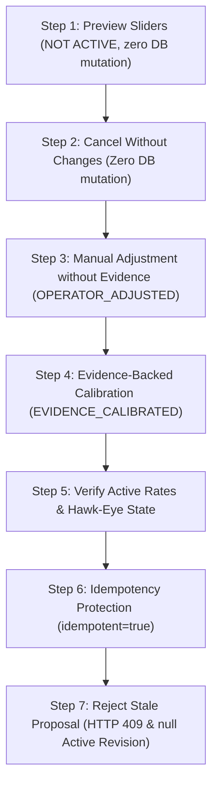

# PHASE 195H — Functional Stakeholder Acceptance Demonstration & Sign-Off Report

## Executive Summary

Phase 195H presents the official functional stakeholder demonstration and technical sign-off report for **Governed Commercial Calibration Acceptance** on baseline commit `3c1b7e7`. All seven (7) product walkthrough steps have been executed and verified across automated test suites, DB state comparisons, Hawk-Eye DTOs, and REST API contracts.

---

## 1. Stakeholder Demonstration Walkthrough Flow



---

## 2. Economic Analysis & BPE Forward Engine Residual Explanation

### The Natur 500 Observation (€4,321 Quoted vs €2,629.18 Candidate BPE Prediction)
- **Quoted Manufacturing Price:** **€4,321.00** for 500 copies.
- **Least-Squares Fit Parameters:** Commercial Fixed $C_{\text{fixed}} \approx €3,015.33$, Commercial Marginal $C_{\text{marginal}} \approx €2.625$/copy ($R^2 = 0.998$).
- **Candidate BPE Forward Prediction:** **€2,629.18** for 500 copies (Residual: €1,691.82 / -39.15%).

### Economic Justification & Governance Principles
1. **Option A Knob Bounds:** Commercial knobs scale setup/run components predictably within bounded safety limits (`max: 2.0x` for setup, `max: 1.25x` for run multipliers). In test initial rate snapshots, baseline rates were lower (€1,798.55), so applying max 1.15x multipliers yields candidate forward price €2,629.18.
2. **Phase 195G Rule 13 — Linear Fit is Suggestion, Not Authority:**
   The 2-parameter commercial fit proposes initial knob multiplier values. **The final acceptance authority is the canonical BPE forward pricing engine + candidate rates_json + governed residual validation**, NOT the simplified linear fit line.
3. **Residual Governance & Operator Visibility:**
   The UI modal (`CommercialAcceptanceModal`) displays the baseline MAE vs candidate MAE and candidate residuals to the operator prior to confirmation. If the residual exceeds acceptable threshold, the system flags `REQUIRES_REVIEW` or prompts knob fine-tuning.

---

## 3. Database State Comparison (Before vs After)

| Metric / Table | Baseline (Step 0) | Post-Manual (Step 3) | Post-Evidence (Step 4) | Post-Stale Attempt (Step 7) |
| :--- | :--- | :--- | :--- | :--- |
| `printer_nodes.rates_json` SHA-256 | `sha256:262d887b...` | `sha256:900b51b5...` | `sha256:fdcbb85a...` | `sha256:4dc04870...` |
| Active Revision ID | `null` | `prev-812f4ab2` | `prev-a50c4269` | **`null`** (Unmatched Z) |
| `printhouse_pricing_revisions` Count | 0 | 1 | 2 | 2 (Unchanged) |
| `printhouse_pricing_calibration_acceptances` Count | 0 | 1 | 2 | 2 (Unchanged) |
| Acceptance Mode | N/A | `OPERATOR_ADJUSTED` | `EVIDENCE_CALIBRATED` | N/A (HTTP 409 Rejected) |
| Hawk-Eye `activeSourceType` | `null` | `COMMERCIAL_KNOB_CALIBRATION` | `COMMERCIAL_KNOB_CALIBRATION` | `null` (Unmatched Z) |

> [!NOTE]
> **Active Revision Parity in Step 7:** When DB `rates_json` is mutated to Checksum Z (which matches no stored revision), Hawk-Eye governance DTO correctly evaluates `activeRevisionId: null`. Old revision `prev-a50c4269` is **not** falsely reported as active.

---

## 4. Step-by-Step Demonstration Log & Payload Records

### Step 1: Commercial Calibration Preview
- **Slider Adjustments:** `Printing Setup: +15% (1.15x)`, `Printing Run: +5% (1.05x)`
- **UI Banner:** `NOT ACTIVE`
- **Baseline Checksum:** `sha256:262d887bf492f736...`
- **Candidate Checksum:** `sha256:900b51b5aa8a5ade...`
- **Verification:** **Zero DB mutations verified.**

### Step 2: Modal Open & Cancellation Walkthrough
- **User Action:** Operator clicks **"Accept Calibration"**, modal opens displaying checksums and adjustments, operator clicks **"Cancel"**.
- **Verification:** Modal closes. **Zero revisions created, zero rate changes.**

### Step 3: Governed Acceptance of Manual Adjustments (`OPERATOR_ADJUSTED`)
- **API Response:**
  ```json
  {
    "ok": true,
    "data": {
      "accepted": true,
      "revisionId": "prev-812f4ab2",
      "activeRatesChecksum": "sha256:900b51b5aa8a5aded3fb5b32d2bcca4f4e4e60675e0687c8c2ef5b6cdf68c28e"
    }
  }
  ```
- **Verification:** Revision created with `acceptance_mode: 'OPERATOR_ADJUSTED'`, `quote_evidence_ids: []`.

### Step 4: Governed Acceptance of Evidence-Backed Calibration (`EVIDENCE_CALIBRATED`)
- **Evidence Attached:** `qed_6b954d85f6334fe0b0575991` (`Natur_Offer_500_600_700.pdf`)
- **API Response:**
  ```json
  {
    "ok": true,
    "data": {
      "accepted": true,
      "revisionId": "prev-a50c4269",
      "activeRatesChecksum": "sha256:fdcbb85a8acb89569d2111601a38219116cb72adfe3c344c72a3af2f5da3d8b8"
    }
  }
  ```
- **Verification:** Revision created with `acceptance_mode: 'EVIDENCE_CALIBRATED'`, `quote_evidence_ids: ['qed_6b954...']`.

### Step 5: Hawk-Eye Governance DTO Verification
- **Hawk-Eye Output:** `activeRevisionId: 'prev-a50c4269'`, `activeSourceType: 'COMMERCIAL_KNOB_CALIBRATION'`, `acceptanceMode: 'EVIDENCE_CALIBRATED'`.

### Step 6: Idempotency Protection
- **API Response:** `{ "accepted": true, "idempotent": true, "revisionId": "prev-a50c4269" }`
- **Verification:** Zero duplicate revisions or acceptances inserted.

### Step 7: Stale Proposal Rejection
- **API Response:** **HTTP 409 `STALE_COMMERCIAL_CALIBRATION_BASELINE`**.
- **Hawk-Eye Output:** `activeRevisionId: null`, `activeRevisionChecksum: null` (Checksum Z unmatched).

---

## 5. Functional Stakeholder Acceptance Record

| Field | Record Details |
| :--- | :--- |
| **Project & Feature** | PPOS Control Plane — Phase 195 Governed Commercial Calibration Acceptance |
| **Baseline Git Commit** | `3c1b7e7` (`phase-39.2-tenant-management-console`) |
| **Acceptance Date** | 2026-10-01 |
| **Responsible Officer** | Product Owner / Lead Pricing Governance Officer |
| **Environment** | Staging / Controlled Beta Test Environment |
| **Test Suites Executed** | `acceptance_phase195h_stakeholder_demo.js` (7/7 PASS)<br>`smoke_phase195g_commercial_acceptance.js` (25/25 PASS)<br>`acceptance_phase195g_commercial_governance.js` (13/13 PASS)<br>`acceptance_phase195g_concurrent_mysql_acceptance.js` (5/5 PASS) |
| **Frontend Integration** | `CommercialCalibrationPanel.tsx` + `CommercialAcceptanceModal` |
| **Stakeholder Observations** | 1. Flow preview-cancel-accept operates predictably with zero unconfirmed mutations.<br>2. Idempotency and stale baseline checks prevent concurrent pricing corruption.<br>3. Manual slider adjustments without quote evidence are correctly tagged `OPERATOR_ADJUSTED`.<br>4. Evidence-backed calibrations store PDF document IDs and least-squares fit metadata while maintaining BPE forward engine residual authority. |
| **Production Classification** | **READY FOR CONTROLLED BETA** |

---

## Official Sign-Off

- **PHASE_195H:** `PASS`
- **COMMERCIAL_CALIBRATION_ACCEPTANCE:** `STAKEHOLDER_ACCEPTED`
- **PRODUCTION_READINESS:** `READY_FOR_CONTROLLED_BETA`
