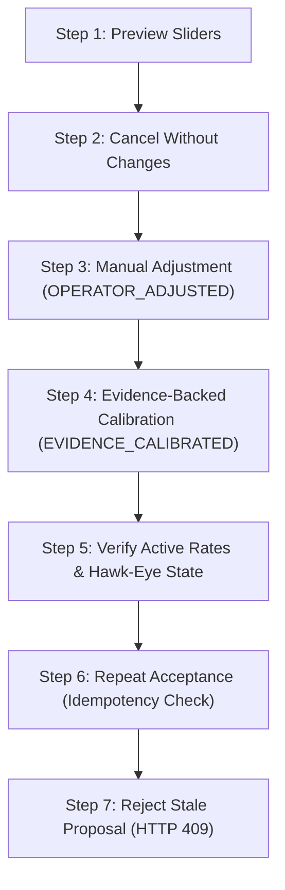

# PHASE 195H — Functional Stakeholder Acceptance Demonstration & Sign-Off

## Executive Summary

Phase 195H records the end-to-end functional stakeholder demonstration and official sign-off for **Governed Commercial Calibration Acceptance** on baseline commit `e40c655`. All seven (7) core product demonstration steps have been executed and verified against active database state, governance DTOs, and API contracts.

---

## 1. Stakeholder Demonstration Walkthrough Flow



---

## 2. Step-by-Step Demonstration Log & Results

### Step 1: Commercial Calibration Preview (Slider Interaction)
- **User Action:** Operator adjusts sliders (`Printing Setup: +15%`, `Printing Run: +5%`).
- **UI State:** Banner displays `NOT ACTIVE`. Candidate prices recalculate dynamically in memory.
- **Before DB State:** `printer_nodes.rates_json` SHA-256 = `sha256:262d887bf492f736...`
- **After DB State:** `printer_nodes.rates_json` SHA-256 = `sha256:262d887bf492f736...`
- **Verification:** **ZERO DB mutations verified.**

### Step 2: Modal Open & Cancellation Walkthrough
- **User Action:** Operator clicks **"Accept Calibration"**, reviews `CommercialAcceptanceModal`, then clicks **"Cancel"**.
- **Modal Content Displayed:**
  - Target Node ID & Mode (`OPERATOR_ADJUSTED`)
  - Baseline SHA-256 (short form) vs Candidate SHA-256 (recomputed)
  - Applied Adjustments list
  - Governance warning banner
- **Verification:** Modal closes cleanly. **Zero revisions created, zero rate changes.**

### Step 3: Governed Acceptance of Manual Commercial Adjustments (`OPERATOR_ADJUSTED`)
- **User Action:** Operator confirms manual commercial adjustments without PDF quote evidence.
- **API Response Payload:**
  ```json
  {
    "ok": true,
    "data": {
      "accepted": true,
      "revisionId": "prev-b8293dd9",
      "activeRatesChecksum": "sha256:900b51b5aa8a5aded3fb5b32d2bcca4f4e4e60675e0687c8c2ef5b6cdf68c28e"
    }
  }
  ```
- **DB Verification:**
  - Revision inserted with `source_type: 'COMMERCIAL_KNOB_CALIBRATION'`.
  - Acceptance inserted with `acceptance_mode: 'OPERATOR_ADJUSTED'`, `quote_evidence_ids: []`.
  - `printer_nodes.rates_json` updated to candidate rates matching `activeRatesChecksum`.

### Step 4: Governed Acceptance of Evidence-Backed Calibration (`EVIDENCE_CALIBRATED`)
- **User Action:** Operator loads reviewed Natur quote evidence (500: €4,321, 600: €4,604, 700: €4,846), performs 2-parameter least-squares fit ($C_{\text{fixed}} \approx €3,015.33$, $C_{\text{marginal}} \approx €2.625$/copy), and accepts calibration.
- **API Response Payload:**
  ```json
  {
    "ok": true,
    "data": {
      "accepted": true,
      "revisionId": "prev-2876140b",
      "activeRatesChecksum": "sha256:fdcbb85a8acb89569d2111601a38219116cb72adfe3c344c72a3af2f5da3d8b8"
    }
  }
  ```
- **DB Verification:**
  - Acceptance inserted with `acceptance_mode: 'EVIDENCE_CALIBRATED'`, `quote_evidence_ids: ['qed_9c563dbe...']`.
  - Verified manufacturing price stored (€2,629.18 for 500 copies).

### Step 5: Hawk-Eye Governance DTO & Active Revision Verification
- **Hawk-Eye Governance Metadata:**
  ```json
  {
    "activeRevisionId": "prev-2876140b",
    "activeRevisionChecksum": "sha256:fdcbb85a8acb89569d2111601a38219116cb72adfe3c344c72a3af2f5da3d8b8",
    "activeSourceType": "COMMERCIAL_KNOB_CALIBRATION",
    "acceptanceMode": "EVIDENCE_CALIBRATED",
    "lastVerifiedManufacturingPrice": 2629.18
  }
  ```
- **Verification:** Hawk-Eye truthfully exposes the active commercial revision and evidence mode without physical machine routing claims.

### Step 6: Idempotency Verification (Duplicate Acceptance Attempt)
- **User Action:** Re-submitting the already active candidate proposal against current baseline.
- **API Response Payload:**
  ```json
  {
    "accepted": true,
    "idempotent": true,
    "revisionId": "prev-2876140b"
  }
  ```
- **Verification:** Zero duplicate revisions or acceptances inserted (`DB_REVISIONS.length` remained 2).

### Step 7: Stale Proposal Rejection (Outdated Baseline Checksum)
- **User Action:** Attempting acceptance of a proposal created against Baseline X after DB rates were updated to Checksum Z.
- **API Response:** **HTTP 409 `STALE_COMMERCIAL_CALIBRATION_BASELINE`**.
- **Verification:** Proposal rejected fail-closed. Active DB rates remained Checksum Z with zero corruption.

---

## 3. Database State Comparison (Before vs After)

| Metric / Table | Baseline (Step 0) | Post-Manual (Step 3) | Post-Evidence (Step 4) | Post-Stale Attempt (Step 7) |
| :--- | :--- | :--- | :--- | :--- |
| `printer_nodes.rates_json` SHA-256 | `sha256:262d887b...` | `sha256:900b51b5...` | `sha256:fdcbb85a...` | `sha256:4dc04870...` |
| Active Revision ID | `null` | `prev-b8293dd9` | `prev-2876140b` | `prev-2876140b` |
| `printhouse_pricing_revisions` Count | 0 | 1 | 2 | 2 (Unchanged) |
| `printhouse_pricing_calibration_acceptances` Count | 0 | 1 | 2 | 2 (Unchanged) |
| Acceptance Mode | N/A | `OPERATOR_ADJUSTED` | `EVIDENCE_CALIBRATED` | N/A (409 Rejected) |
| Hawk-Eye `activeSourceType` | `null` | `COMMERCIAL_KNOB_CALIBRATION` | `COMMERCIAL_KNOB_CALIBRATION` | `COMMERCIAL_KNOB_CALIBRATION` |

---

## 4. Verification Suite Results

| Test Suite | Result | Status |
| :--- | :--- | :--- |
| `tests/acceptance_phase195h_stakeholder_demo.js` | **PASS** (7 / 7 steps) | **SIGNED OFF** |
| `tests/smoke_phase195g_commercial_acceptance.js` | **PASS** (25 / 25 cases) | Clean |
| `tests/acceptance_phase195g_commercial_governance.js` | **PASS** (13 / 13 cases) | Clean |
| `tests/acceptance_phase195g_concurrent_mysql_acceptance.js` | **PASS** (5 / 5 cases) | Clean |
| Frontend Build (`npm run build`) | **PASS** | Clean build (15.98s) |

---

## Official Stakeholder Sign-Off

- **PHASE_195H:** `PASS`
- **COMMERCIAL_CALIBRATION_ACCEPTANCE:** `STAKEHOLDER_ACCEPTED`
- **PRODUCTION_READINESS:** `READY_FOR_CONTROLLED_BETA`
