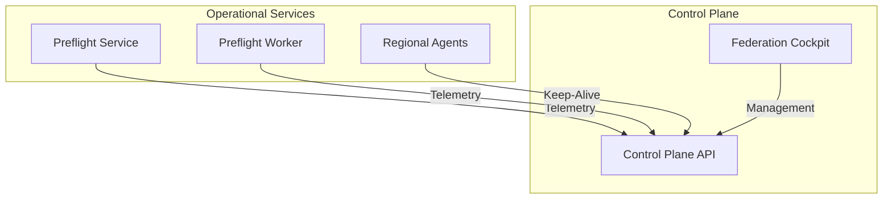

# PrintPrice OS — Control Plane (`ppos-control-plane`)

## 1. Repository Role
The `ppos-control-plane` is the **Observability & Governance Hub** of the PrintPrice OS. it provides a centralized interface and API for monitoring the health of the federated print network, managing cross-regional policies, and coordinating failover events.

## 2. Architecture Position
It acts as the aggregator for telemetry from all operational services (`preflight`, `worker`, `governance`) and provides the operators with a "Cockpit" UI.



## 3. Responsibilities
- **Federated Health Monitoring**: Real-time aggregation of service status across regions.
- **Incident Coordination**: Surfacing stuck jobs, regional outages, and policy violations.
- **Policy Distribution**: Distributing global governance updates to operational regions.
- **Operator Cockpit**: Visual UI for manual intervention and network health visualization.

## 4. Key Features
- **Health Federation API**: Endpoint `/federation/health` for multi-regional health aggregation.
- **Incident Dashboard**: Tracking of failed or quarantined PDF assets.
- **Audit Logging**: Immutable record of all policy changes and operator interventions.

## 5. Dependency Relationships
- **Service Consumers**: All PPOS services report metadata to the Control Plane.
- **Foundation**: Consumes `ppos-shared-infra` for FSS (Federated State Sync) and identity logic.

## 6. Local Development

### Installation
```bash
npm install
```

### Running Locally
```bash
# Start the Dashboard & API
node server.js
```
The dashboard defaults to port `8080` (API) and `3001` (UI dev).

## 7. Environment Variables
| Variable | Description | Default |
| :--- | :--- | :--- |
| `PPOS_CONTROL_PLANE_PORT` | Listening port for the API | `8080` |
| `PPOS_ENVIRONMENT` | Environment (dev/staging/prod) | `development` |
| `JWT_SECRET` | Secret for operator authentication | `ppos-dev-only` |

## 8. Version Baseline
**Current Version**: `v1.9.0` (Federated Health & Decoupling Pass)

---
© 2026 PrintPrice. Distributed Execution Infrastructure.