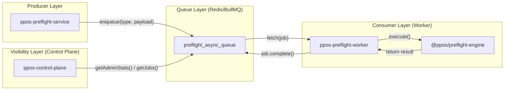

# JOB_FLOW_CURRENT_STATE

**Version**: 1.9.0
**Domain**: Runtime Operational Flow

## 📡 End-to-End Architecture



## 📋 Technical Specifications

| Component | Detail |
| :--- | :--- |
| **Queue Name** | `preflight_async_queue` |
| **Backend Storage** | Redis (`127.0.0.1:6379`) |
| **Job Types** | `ANALYZE`, `AUTOFIX` |
| **Status Mapping** | `QUEUED` (BullMQ: waiting) → `PROCESSING` (BullMQ: active) → `COMPLETED`/`FAILED` |

## 📦 Payload Schema

### Job: `ANALYZE`
```json
{
  "filePath": "/temp-staging/file-uuid.pdf",
  "tenantId": "t-123",
  "assetId": "a-456"
}
```

### Job: `AUTOFIX`
```json
{
  "asset_id": "a-456",
  "policy": "PRINT_READY_v2",
  "tenant_id": "t-123",
  "options": {}
}
```

## 🔍 Visibility Path
The **Control Plane** uses the `queueOperator.js` adapter which directly queries the `bull:preflight_async_queue:*` keys in Redis to extract:
1. **Backlog count** (Waiting + Delayed)
2. **Active jobs** (Processing)
3. **Historical jobs** (Completed / Failed)
4. **Worker health** (Estimated by worker keys)
