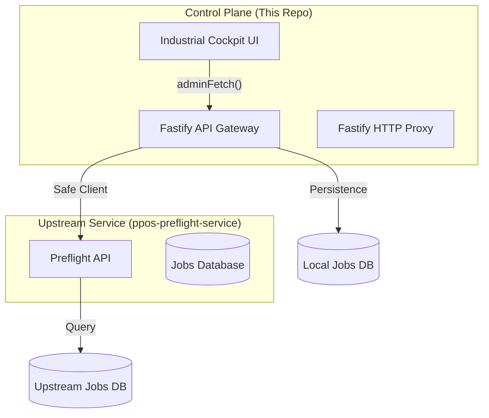

# Audit: Preflight Operations Module (Control Plane)

**Date**: 2026-04-30
**Status**: Milestone 1 (Read-Only) Completed. Transitions to Milestone 2 (Operations & Governance) required.

---

## 1. Architecture Map

---

## 2. File Inventory

### Services (`src/api/services/`)
- `preflightOperationsService.js`: Main orchestrator.
- `preflightPersistenceService.js`: Local MySQL persistence.
- `preflightServiceClient.js`: Upstream API client with identity preservation.
- `preflightStorageService.js`: FS management and path resolution.
- `preflightQuotaService.js`: 2GB limit enforcement.

### UI Pages (`src/ui/pages/preflight/`)
- `PreflightJobsPage.tsx`: Job dashboard with forensic search.
- `PreflightJobDetailPage.tsx`: Deep-dive view with AuditTimeline and artifacts.
- `PreflightLargeDocumentsPage.tsx`: Filtered view (>500MB) for risk identification.
- `PreflightArtifactsPage.tsx`: Registry of all generated PDF artifacts.
- `PreflightCertificatesPage.tsx`: Ledger of certified documents.
- `PreflightQuotasPage.tsx`: Tenant usage visualization.
- `PreflightWorkersPage.tsx`: Infrastructure health and utilization.

### Infrastructure
- `src/ui/lib/adminApi.ts`: Normalized API client (fetch wrapper).
- `server.js`: Proxy registration and auth bypass logic.
- `src/ui/layout/Sidebar.tsx`: Navigation group registration.
- `src/ui/App.tsx`: React Router definitions.

---

## 3. Endpoint Inventory

| Endpoint | Status | Upstream Source | Implementation Detail |
| :--- | :--- | :--- | :--- |
| `GET /api/admin/preflight/jobs` | **LIVE (NEW)** | Control Plane DB | Persistent job records. |
| `GET /api/admin/preflight/health` | **LIVE (NEW)** | `ppos-preflight-service` | Backend-to-backend health check. |
| `GET /api/admin/preflight/storage` | **LIVE (NEW)** | `ppos-preflight-service` | Consolidated storage metrics. |
| `POST /api/admin/preflight/upload` | **LIVE (NEW)** | Local FS | Multi-tenant PDF upload with 2GB quota check. |
| `POST /api/admin/preflight/jobs` | **LIVE (NEW)** | Control Plane DB | Persistent job creation from uploads. |
| `GET /api/admin/preflight/artifacts/:id/download` | **LIVE (NEW)** | Local FS | Secure streaming download with path protection. |
| `DELETE /api/admin/preflight/artifacts/:id` | **LIVE (NEW)** | Control Plane DB | Soft-delete of artifacts. |

---

## 4. Gap Analysis & Risks

### Persistence & Data Ownership
- **Local Storage**: **IMPLEMENTED**. The Control Plane now persists preflight job and artifact metadata in the `preflight_jobs` and `preflight_artifacts` tables.
- **No Queue Visibility (BullMQ)**: While worker health is visible, the actual BullMQ queues are not directly inspected by the Control Plane (only via upstream proxy).

### Quota Enforcement
- **Hardcoded Thresholds**: The 500MB "Large Document" filter is hardcoded in the UI.
- **2GB Quota Enforcement**: **MISSING**. There is no logic in `server.js` or `adminApi` to block uploads or job creation if a tenant exceeds 2GB.
- **Tenant Context**: `adminApi` has support for `X-Tenant-Id`, but it is not enforced globally at the proxy level.

### Security & Auth
- **Auth Bypass (CRITICAL)**: `server.js` line 25 bypasses the Control Plane's token validation for `/api/preflight`.
- **System Token Leak**: If the upstream service requires a master system token, the Control Plane is currently just forwarding what the client sends.
- **Tenant Isolation**: There is no server-side validation that an admin is only accessing jobs for a specific tenant if requested (Admin is currently "God Mode").

### Operations (Write Actions)
- **Workflow Triggers**: No way to manually trigger "Analyze", "Autofix", or "Certify" from the Control Plane UI.
- **Artifact Management**: No "Delete" or "Expire" actions implemented for storage cleanup.

---

## 5. Risk Assessment

| Risk | Level | Description |
| :--- | :--- | :--- |
| **Auth Bypass** | **CRITICAL** | `/api/preflight` endpoints are accessible without the Control Plane `Authorization` header check. |
| **Missing Quota Enforcement** | **HIGH** | Tenants can potentially flood storage beyond the 2GB limit as no server-side check exists. |
| **Read-Only Lock-in** | **MEDIUM** | Zero ability to recover failed jobs or delete artifacts from the admin UI. |
| **Proxy Dependency** | **LOW** | Complete downtime if the preflight service on port 8001 fails (handled by graceful UI degradation). |

---

## 6. Recommended Phases

### Phase 2: Operations Hardening
1. Implement `POST /api/preflight/upload` proxy with multipart support.
2. Add "Trigger Job" modal to the UI.
3. Fix the Auth Hook in `server.js` to validate tokens for all preflight routes.

### Phase 3: Governance & Quotas (COMPLETED)
1. Implement a local Quota Cache or Middleware to enforce the 2GB limit. (DONE)
2. Add "Delete Job/Artifact" actions. (DONE)
3. Multi-tenant storage visualization. (DONE)
3. Integrate real BullMQ status readers.

---

## 7. Storage Architecture (Technical Notes)

### Physical Layout
The Control Plane enforces a hierarchical storage structure under `PPOS_PREFLIGHT_STORAGE_ROOT`:
- `/tenants/<tenantId>/uploads/`: Source files pending processing.
- `/tenants/<tenantId>/jobs/<jobId>/`: Job-specific artifacts.
  - `input/`: Copy of the original file.
  - `output/`: Processed/Fixed PDF.
  - `reports/`: JSON/PDF audit reports.
  - `logs/`: Worker execution logs.

### Quota Enforcement
- **Default Quota**: 2GB (2,147,483,648 bytes) per tenant.
- **Mechanism**: `PreflightQuotaService.assertTenantHasStorageCapacity` performs a recursive disk scan before accepting new writes.
- **Security**: Path traversal is prevented via strict sanitization and `path.resolve` validation in `PreflightStorageService`.
