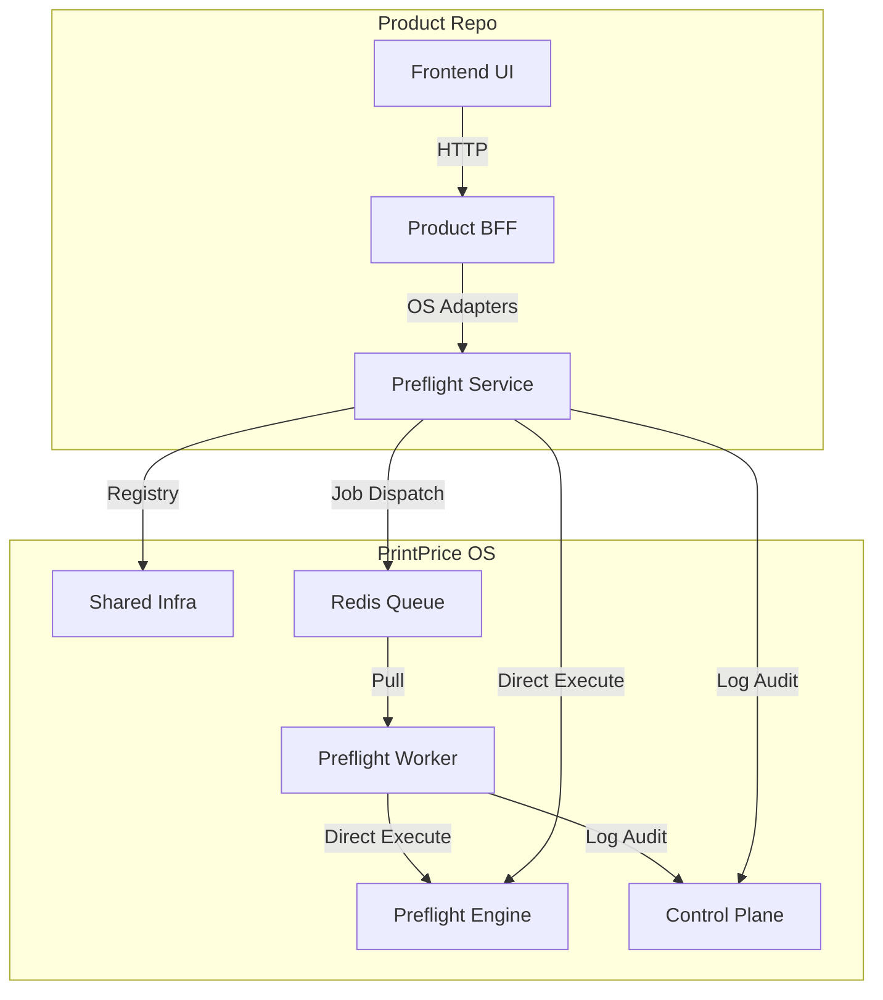

# PrintPrice OS & Product — Master Ecosystem Architecture (V1.9.0)

## 🏗 Ecosystem Overview
The PrintPrice platform is a distributed print production intelligence system.  
It is built on a **Platform-Client** model:
- **Product** (`PrintPricePro_Preflight`): The customer-facing BFF and UI.
- **OS** (PPOS): A set of six decoupled, modular repositories providing industrial-grade services.

---

## 🏛 Component Taxonomy

### 1. The Core OS (Industrial Fabric)
| Repository | Role | Technology |
| :--- | :--- | :--- |
| **`ppos-shared-infra`** | Backbone: Database (MySQL), Messaging (Redis/Queue), and Auth. | Node.js, BullsMQ, Sequelize |
| **`ppos-control-plane`** | Governance: Federated health monitoring and observability. | React (Admin), HTTP Proxy |
| **`ppos-preflight-engine`**| Engine: The deterministic kernel for technical analysis. | Node.js, Ghostscript, pdf-lib |
| **`ppos-preflight-service`**| Interface: API layer for product-to-OS consumption. | Express, Multer, Axios |
| **`ppos-preflight-worker`** | Power: Horizontal processing of high-load PDF jobs. | BullMQ, Node Worker Threads |

### 2. The Product (BFF & UI Client)
| Repository | Role | Phase Status |
| :--- | :--- | :--- |
| **`PrintPriceProduct`** | Final consumer application (PDF tools UI + AI Magic Fix). | **V1.9.0 (Consolidated)** |

---

## 🧬 Integration Map (Runtime Data Flow)

---

## 🔒 Security & Governance (V1.9.0 Baseline)
- **Zero-Trust (In-Progress)**: Communication between Product and OS requires an `apiKey` (Configured in `/config/ppos.js`).
- **Federated Health**: The Control Plane monitors the health of all PPOS instances across the network.
- **Quarantine**: Malicious or corrupted files are isolated in `uploads-quarantine/` before OS ingestion.

---

## 🚀 Deployment & Operational Matrix

### Local Development
The PPOS repos are linked into the product's `workspace/` directory.  
Adapters use local stubs (`file:` paths) to prioritize speed and local testing.

### Production Execution
The product calls the **canonical OS endpoints** (defined via environment variables).  
Each OS service scales independently within its cluster or region.

---

## 📋 Milestone: V1.9.0 "The Great Decoupling"
- **Status**: ✅ COMPLETED
- **Veredict**: The core intelligence kernel has been successfully extracted from the product.
- **Current Baseline**: `release/v1.9.0-product-os-decoupled`

**Certified by Antigravity AI**  
*Date: 2026-03-16*
