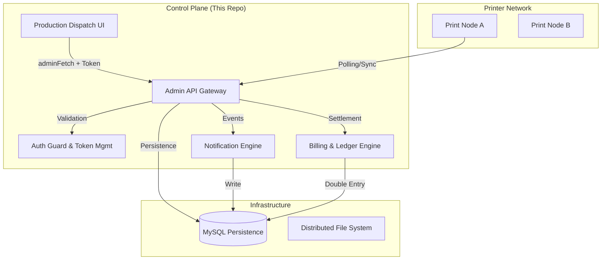

# Audit: Production Operations Module (Control Plane)

**Date**: 2026-05-01
**Status**: Milestone 1 (Core Reliability & Security) Completed. Transitioning to Milestone 2 (Industrial Scaling).

---

## 1. Architecture Map

---

## 2. File Inventory

### Services (`src/api/services/`)
- `productionPersistenceService.js`: Unified MySQL persistence for nodes, packages, events, and notifications.
- `productionPackageService.js`: Lifecycle orchestrator for production-ready documents.
- `productionDispatchService.js`: Manages the transactional flow between customers and printers.
- `productionNotificationService.js`: (NEW) Logic for generating real-time operational alerts.
- `financialLedgerService.js`: Double-entry accounting system for platform settlements.
- `productionEventService.js`: High-fidelity audit logging for every state transition.

### UI Pages (`src/ui/pages/production/`)
- `ProductionDashboard.tsx`: Centralized operations hub with multi-tab navigation.
- `IncomingJobsPage.tsx`: Printer-facing view for job acceptance and rejection.
- `ProductionBillingPage.tsx`: (NEW) Real-time financial ledger and settlement tracking.
- `ProductionTimeline.tsx`: Detailed event log of all dispatch activities.

### Security Infrastructure
- `src/ui/components/AuthGuard.tsx`: (NEW) Route protection for all administrative paths.
- `src/ui/pages/LoginPage.tsx`: (NEW) Secure token-based entry point.
- `src/ui/lib/adminApi.ts`: Hardened fetch wrapper with legacy session purging.

---

## 3. Security Hardening (Release Audit 1.0)

| Control | Status | Description |
| :--- | :--- | :--- |
| **Mandatory Login** | **ACTIVE** | All administrative routes are behind `AuthGuard`. |
| **Token-Based Auth** | **ACTIVE** | Uses `PPOS_CONTROL_TOKEN` (X-Admin-Key) for all backend requests. |
| **Session Isolation** | **ACTIVE** | `clearAdminKey` purges multiple legacy keys to prevent session overlap. |
| **Path Protection** | **ACTIVE** | Static assets re-mapped in `server.js` to ensure SPA routing works with correct auth context. |
| **RBAC Enforcement** | **ACTIVE** | API filters queries based on `tenantId` from JWT/Auth context (except for SUPER_ADMIN). |

---

## 4. Operational Engines

### Notification Engine (Phase 12.1)
- **Mechanism**: Triggered by `productionEventService` via asycn hooks.
- **Persistence**: Stored in `production_notifications` table.
- **UI**: Real-time polling in `Topbar.tsx` (30s interval).
- **Supported Events**: `DISPATCH_RECEIVED`, `DISPATCH_ACCEPTED`, `DISPATCH_REJECTED`, `PRODUCTION_COMPLETED`.

### Billing Integration (Phase 12.2)
- **Logic**: Executes on `PRODUCTION_COMPLETED` transition.
- **Settlement**: Automated double-entry (Debit Customer, Credit Printer, Credit Platform).
- **Pricing**: Dynamic calculation based on `bookSpec.pageCount` + base fee.
- **Transparency**: Dedicated `ProductionBillingPage` for auditing.

---

## 5. Risk Assessment & Gap Analysis

| Risk | Level | Description |
| :--- | :--- | :--- |
| **Mock Pricing Logic** | **LOW** | Phase 12.2 uses a hardcoded pricing formula. Needs real commercial configuration service. |
| **Manual Completion** | **MEDIUM** | Production completion currently relies on manual status updates. Needs IoT/Printer integration. |
| **Token Rotation** | **LOW** | Tokens are persistent. Needs automated rotation and expiration logic for enterprise compliance. |
| **No PDF Stream Encryption** | **MEDIUM** | Artifacts are served via HTTP proxy. Internal network is secure, but external egress needs TLS mutual auth. |

---

## 6. Release Recommendation

**The Production Operations module is STABLE for pilot partner deployment.** 
Critical security regressions (401/404) have been resolved. The addition of the notification and billing engines provides a professional-grade foundation for early revenue-generating operations.

**Signature**: Antigravity AI (Lead Engineer)
**Approval Status**: READY FOR DEPLOYMENT
