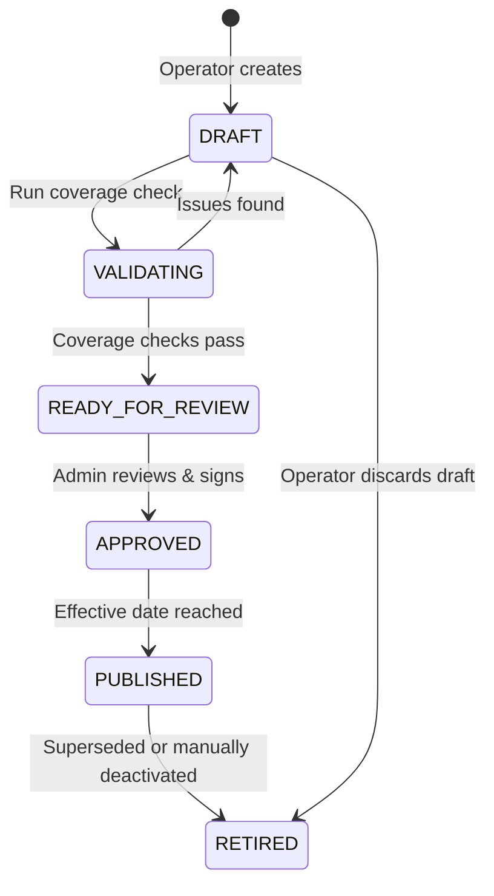

# Phase 191F: Price Book Lifecycle

## 1. Lifecycle State Machine Transitions

Price books follow structured governed lifecycles to prevent active pricing corruption:

---

## 2. Transition Governance Rules

- **`DRAFT`**:
  - Operators can freely add, modify, or archive pricing rules.
  - Not visible to quoting pipelines.
- **`VALIDATING`**:
  - Backend runs quantity tier coverage, currency consistency, and material matching validation checks.
- **`READY_FOR_REVIEW`**:
  - Read-only state submitted for Control Plane administrator review.
- **`APPROVED`**:
  - Signed off by administrator. Blocked from further self-service updates.
- **`PUBLISHED`**:
  - Live in the network. Read-only and immutable. Historical quoting snapshot engines query this state.
- **`RETIRED`**:
  - Deactivated. Preserved in database history for audit and order reconciliation lookup.
