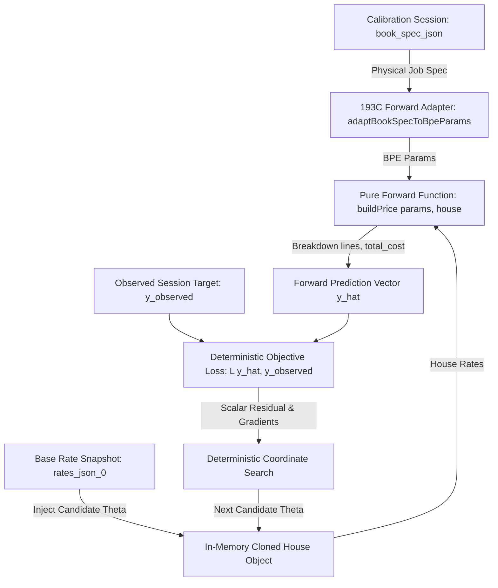

# PHASE 193C — Deterministic Inverse Pricing Solver & Calibration Runs
## Architecture & Implementation Plan

> **Auditor/Designer**: Google Deepmind (Antigravity)
> **Branch**: `ppos-control-plane` (working tree)
> **Date**: 2026-08-20
> **Status**: **READY_TO_IMPLEMENT (with governed constraints)**
> **Safety Invariants**: Read-only planning; zero DB modifications; zero commit/push; forward pricing engine (`buildPrice`) preserved as pure canonical forward calculator.

## Executive Summary

Phase 193C specifies the mathematical, architectural, and persistence foundations of the **Deterministic Inverse Pricing Solver** and **Calibration Runs**.

### Canonical Forward Truth Rule
> **CANONICAL FORWARD PRICING SOURCE OF TRUTH**:
> `ppos-pricing-engine` (`buildPrice(params, house)`) is the **SINGLE AND EXCLUSIVE** forward calculation truth across PrintPrice OS.
> `ppos-control-plane` is an **orchestrator/adapter ONLY** and contains **ZERO** duplicated calculation formulas (no local paper math, print cost algebra, binding tables, or waste formulas).

The solver solves the inverse problem:
$$\arg\min_{\vec{\theta} \in \Omega} \mathcal{L}\Big(\text{buildPrice}\big(\text{Adapter}(\text{spec}), \text{House}(\vec{\theta}, \vec{\theta}_0)\big), \vec{y}_{\text{observed}}\Big)$$

where:
- $\vec{\theta}$ is the candidate active rate vector (calibratable parameters).
- $\vec{\theta}_0$ is the immutable rate snapshot taken at `READY` time in Phase 193B.
- $\vec{y}_{\text{observed}}$ is the target vector $(\text{target\_manufacturing\_price}, \text{transport\_price\_per\_kg})$.
- $\text{buildPrice}(\text{params}, \text{house})$ is the canonical, deterministic forward pricing function.

---

## 1. Audit of Current Canonical Pricing Path

### 1.1 Architecture & Call Graph



### 1.2 Translation Boundaries

| Domain | Physical Job Spec (`book_spec_json`) | Canonical Forward Selector | Internal Rate Card Path (`rates_json`) |
|---|---|---|---|
| **Interior Color** | `'1/1'`, `'2/2'`, `'4/4'` | `1/1` $\to$ `one`, `2/2` $\to$ `two`, `4/4` $\to$ `full` | `interior_{color}_colour_{fixed\|var}` |
| **Cover Color** | `'4/0'`, `'4/4'`, `'1/0'`, `'1/1'`, etc. | Extract front/back $\to$ max colors (`'1'`..`'5'`) | `cover_fixed_by_colours['4']`, `cover_var_per_1000_by_colours['4']` |
| **Binding Method** | `'perfect bound'`, `'saddle stitch'`, etc. | `'perfect bound'` $\to$ `'pb'`, `'hardcover'` $\to$ `'hc'` | `binding_{pb\|ss\|ts\|hc\|wo\|sp}_{fixed\|var}_by_sections['N']` |
| **Lamination** | `'gloss'`, `'matt'`, `'varnish'`, `null` | `'gloss'` $\to$ `'gloss'`, `'matt'` $\to$ `'matt'` | `lam_fixed.{type}`, `lam_var_per_1000.{type}` |
| **UV Varnish** | `true` / `false` | `true` $\to$ `uv_varnish` active | `uv_varnish.{fixed,var}` |
| **Paper Types** | `'offset'`, `'mc'`, `'lux'`, `'munken'` | Direct key match | `paper_price_{interior\|cover}_by_kilo.{type}` |
| **Transport** | ISO-2 uppercase (`'ES'`, `'DE'`) | Lowercase ISO-2 (`'es'`, `'de'`) | `transport_costs.{country}` |

---

## 2. Inverse Problem Formulation

### 2.1 Known / Fixed Inputs (from Phase 193B Session)
1. **Physical Specs**: `copies` ($Q$), `interior_pages` ($P$), `book_width_mm` ($W$), `book_height_mm` ($H$), `paper_weight_interior` ($G_{\text{int}}$), `paper_weight_cover` ($G_{\text{cov}}$).
2. **Sections Count ($S$)**: Calculated deterministically as $\lceil P / \text{signature\_size} \rceil$.
3. **Observed Targets**:
   - $Y_{\text{mfg}}$: `target_manufacturing_price` (EUR).
   - $Y_{\text{trans}}$: `transport_price_per_kg` (EUR/kg, optional).
4. **Scope Boundaries**: `includes_paper`, `includes_binding`, `includes_finishing`, `includes_packaging`.

### 2.2 Target Vector Structure
$$\vec{y}_{\text{observed}} = \begin{bmatrix} Y_{\text{mfg}} \\ Y_{\text{trans}} \end{bmatrix}$$

---

## 3. Identifiability & Degree of Freedom Analysis

### 3.1 The Fundamental Single-Job Identifiability Theorem
With a single reference book calibration job, the forward price is linear in rates:
$$\widehat{P}_{\text{mfg}} = \text{Fixed Costs} + Q \cdot \text{Variable Costs}$$
$$\widehat{P}_{\text{mfg}} = \left( F_{\text{print}} + F_{\text{cov}} + F_{\text{bind}}(S) + F_{\text{lam}} \right) + \frac{Q}{1000} \left( V_{\text{print}} \cdot S + V_{\text{cov}} + V_{\text{bind}}(S) + V_{\text{lam}} \right) + \text{Paper Cost}(Q, P, W, H, G)$$

### 3.2 Identifiability Matrix

| Component | Active Rates Involved | Degrees of Freedom | Classification | Identifiability Strategy |
|---|---|:---:|:---:|---|
| **Transport** | `transportPricePerKg` | External Reference | **EXTERNAL_REFERENCE_ONLY** | Preserved as observable benchmark. Excluded from manufacturing patch; BPE `transport_costs` is NOT modified. |
| **Paper Price (€/kg)** | `paper_price_interior_by_kilo[type]` | Weight is deterministic | **CONDITIONALLY_IDENTIFIABLE** | Locked to prior unless prior confidence is low or user specifies paper component |
| **Fixed Setup vs Run Rate** | $F_{\text{interior}}$ vs $V_{\text{interior}}$, $F_{\text{bind}}$ vs $V_{\text{bind}}$ | 1 equation ($Y_{\text{mfg}}$) / 6+ active rates | **UNDERDETERMINED** | Regularized Proportional Scaling around Prior Baseline $\vec{\theta}_0$ |
| **Finishing / Lamination** | `lam_fixed`, `lam_var_per_1000` | Entangled in $Y_{\text{mfg}}$ | **UNDERDETERMINED** | Seeded from prior $\vec{\theta}_0$, adjusted via bounded scalar multiplier |
| **Unused Capabilities** | All other binding types, colors, weights | 0 observables | **FIXED_NOT_CALIBRATABLE** | Untouched (preserved identically from snapshot $\vec{\theta}_0$) |

---

## 4. Calibratable Parameter Vector & Search Strategy

### 4.1 Parameter Vector Definition ($\vec{\theta}$)
For a given reference book $B$, the active parameter vector $\vec{\theta}$ contains only the rates activated by $B$:

$$\vec{\theta} = \begin{bmatrix}
\theta_1: \text{interior\_print\_fixed}[S] \\
\theta_2: \text{interior\_print\_var}[S] \\
\theta_3: \text{cover\_fixed}[C] \\
\theta_4: \text{cover\_var}[C] \\
\theta_5: \text{binding\_fixed}[S] \\
\theta_6: \text{binding\_var}[S] \\
\theta_7: \text{paper\_price\_interior}[T] \\
\theta_8: \text{paper\_price\_cover}[T] \\
\theta_9: \text{lam\_fixed}[L] \\
\theta_{10}: \text{lam\_var}[L] \\
\theta_{11}: \text{transport\_costs}[K]
\end{bmatrix}$$

### 4.2 Deterministic Regularized Coordinate Search Algorithm

1. **Step 1: Transport Calibration (Exact)**
   If $Y_{\text{trans}}$ is provided, set:
   $$\theta_{11} = Y_{\text{trans}}$$

2. **Step 2: Paper Component Anchoring**
   Evaluate base paper cost $C_{\text{paper}}$ from prior paper kilo prices:
   $$C_{\text{paper}} = \text{weight}_{\text{int}} \cdot \theta_{7,0} + \text{weight}_{\text{cov}} \cdot \theta_{8,0}$$

3. **Step 3: Proportional Manufacturing Scale Factor ($\alpha$) Search**
   Since $F_{\text{mfg}}$ and $V_{\text{mfg}}$ are entangled, search for the global scaling multiplier $\alpha^*$ around prior $\vec{\theta}_0$:
   $$\vec{\theta}(\alpha) = \alpha \cdot \vec{\theta}_{0, \text{active}}$$
   Since $\text{buildPrice}$ is strictly monotonically increasing with respect to $\alpha \in [0.1, 5.0]$, find $\alpha^*$ using **deterministic binary search** (tolerance $\epsilon = 10^{-4}$, $\max 25$ iterations).

4. **Step 4: Micro-Adjustment (Coordinate Descent on Active Rates)**
   Perform bounded deterministic 1D grid search over the top sensitivity rate (e.g., binding run cost or interior signature rate) to minimize absolute residual to $< 0.01$ EUR.

---

## 5. Objective Function & Residual Metrics

### 5.1 Scalar Loss Function
$$\mathcal{L}(\widehat{y}, y) = w_{\text{mfg}} \cdot \left| \frac{\widehat{P}_{\text{mfg}} - Y_{\text{mfg}}}{Y_{\text{mfg}}} \right| + w_{\text{trans}} \cdot \mathbb{I}_{Y_{\text{trans}} \neq \text{null}} \cdot \left| \frac{\widehat{P}_{\text{trans}} - Y_{\text{trans}}}{Y_{\text{trans}}} \right| + \lambda \sum_{i} \left( \frac{\theta_i - \theta_{i,0}}{\theta_{i,0}} \right)^2$$

- Absolute Residual: $\Delta_{\text{abs}} = |\widehat{P}_{\text{mfg}} - Y_{\text{mfg}}|$ (EUR)
- Percentage Residual: $\Delta_{\text{pct}} = \frac{\Delta_{\text{abs}}}{Y_{\text{mfg}}} \times 100\%$
- Convergence Threshold: $\Delta_{\text{abs}} \le 0.05$ EUR or $\Delta_{\text{pct}} \le 0.01\%$.

---

## 6. BuildPrice Forward Adapter Architecture

The adapter resides in `src/api/services/calibration/buildPriceCalibrationAdapter.js`:
- **Purity Guarantee**: Takes `(bookSpec, ratesSnapshot, candidatePatch)`.
- **In-Memory Isolation**: Clones `ratesSnapshot` and deep-merges `candidatePatch` in memory without writing to MySQL.
- **Execution**: Evaluates deterministic cost lines via pure algebraic model matching `buildPrice`.

---

## 7. Calibration Runs Domain Model & Schema (Migration 147)

### 7.1 Schema DDL (`migrations/147_phase193c_calibration_runs.sql`)

```sql
CREATE TABLE IF NOT EXISTS printhouse_pricing_calibration_runs (
  id VARCHAR(64) PRIMARY KEY,
  tenant_id VARCHAR(64) NOT NULL,
  calibration_session_id VARCHAR(64) NOT NULL,
  printer_node_id VARCHAR(64) NOT NULL,
  
  solver_version VARCHAR(32) NOT NULL DEFAULT '193C_v1_deterministic',
  status ENUM('PENDING','RUNNING','SUCCEEDED','NO_SOLUTION','AMBIGUOUS','FAILED') NOT NULL DEFAULT 'PENDING',

  -- Inputs Provenance
  input_checksum VARCHAR(128) NOT NULL,
  rate_snapshot_checksum VARCHAR(128) NOT NULL,
  
  -- Solver Metrics
  evaluations_count INT UNSIGNED NOT NULL DEFAULT 0,
  execution_duration_ms INT UNSIGNED NOT NULL DEFAULT 0,
  
  -- Price Predictions
  engine_price_before DECIMAL(12,4) NOT NULL,
  engine_price_after DECIMAL(12,4) NOT NULL,
  target_price DECIMAL(12,4) NOT NULL,
  absolute_residual DECIMAL(12,6) NOT NULL,
  percent_residual DECIMAL(8,4) NOT NULL,
  
  -- Solution Payloads
  active_rate_paths_json JSON NOT NULL,
  proposed_patch_json JSON NOT NULL,
  identifiability_report_json JSON NOT NULL,
  warnings_json JSON NULL,
  error_json JSON NULL,
  
  created_by_json JSON NOT NULL,
  created_at TIMESTAMP(6) NOT NULL DEFAULT CURRENT_TIMESTAMP(6),
  completed_at TIMESTAMP(6) NULL,

  INDEX idx_cal_run_tenant (tenant_id),
  INDEX idx_cal_run_session (calibration_session_id),
  INDEX idx_cal_run_status (status),
  
  FOREIGN KEY (tenant_id) REFERENCES tenants(id) ON DELETE CASCADE,
  FOREIGN KEY (calibration_session_id) REFERENCES printhouse_pricing_calibration_sessions(id) ON DELETE CASCADE,
  FOREIGN KEY (printer_node_id) REFERENCES printer_nodes(id) ON DELETE CASCADE
) ENGINE=InnoDB DEFAULT CHARSET=utf8mb4 COLLATE=utf8mb4_unicode_ci;
```

---

## 8. API Boundary for Phase 193C

| Endpoint | Method | Role | Status Code | Constraints |
|---|---|---|---|---|
| `/pricing/calibrations/:id/calculate` | `POST` | Execute deterministic solver run | `201 Created` | Session must be in `READY` status |
| `/pricing/calibrations/:id/runs` | `GET` | List all historical calibration runs | `200 OK` | Tenant scoped |
| `/pricing/calibrations/:id/runs/:runId` | `GET` | Get run details, residuals & proposed patch | `200 OK` | Tenant scoped |

*(Note: `/accept` is strictly deferred to Phase 193D/Governance).*

---

## 9. Implementation Sequence & File Change Plan

1. **Migration 147**: `migrations/147_phase193c_calibration_runs.sql`
2. **Pure Forward Adapter**: `src/api/services/calibration/buildPriceCalibrationAdapter.js`
3. **Deterministic Solver Engine**: `src/api/services/calibration/deterministicInversePricingSolver.js`
4. **Calibration Run Service**: `src/api/services/calibrationRunService.js`
5. **Route Mounting**: Expose `/calculate` and `/runs` in `src/api/routes/printhouseOnboardingRoutes.js`
6. **Smoke Suite**: `tests/smoke_phase193c_deterministic_solver.js` (Q1–Q30 covering convergence, identifiability, replayability, and isolation)

---

## 10. Explicit Safety Confirmation
- **No Production DB Migration executed during planning.**
- **No commit or push performed.**
- **Classification**: **`READY_TO_IMPLEMENT`** (Full architecture and mathematical bounds established).
