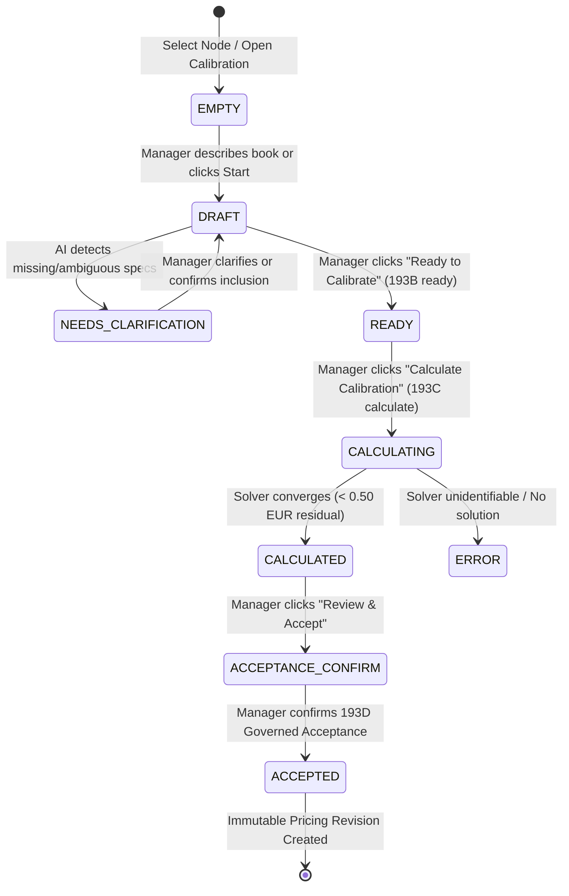

# PHASE 193F.1 — FRONTEND QUICK CALIBRATION UX & INTEGRATION ARCHITECTURE

> **Status**: **PASS (DESIGN & INTEGRATION AUDIT)**  
> **Backend Baseline**: `193B` (Foundation) $\to$ `193C` (Solver) $\to$ `193D` (Governed Acceptance) $\to$ `193E` (AI Assistant)  
> **Canonical Tag Baseline**: `phase-193e-conversational-calibration-assistant` (`a6c7a2fe8c28481f94d5aa889dd03ea8c4c14987`)  
> **Production Deployment**: `NOT_AUTHORIZED`

---

## 1. Current Pricing UI Audit (`F1`)

- **Location**: `src/ui/pages/printhouse/PrinthouseSetupHub.tsx` (Tab index 2: `PRICING`) $\to$ mounts `src/ui/components/printhouse/setup/PricingPanel.tsx`.
- **Node Context**: Primary node loaded via `/api/printhouse/onboarding/pricing/industrial`, returning `{ nodeId, signatures, deliveryTime, productionLeadDays, limits, rates }`.
- **Current Layout & Conventions**:
  - Primary element: `<CanonicalIndustrialPricingEditor>` containing 8 detailed tabs (`Basic`, `Operational`, `Interior`, `Cover & Endpapers`, `Lamination & UV`, `Binding`, `Paper Costs`, `Transport`).
  - Secondary accordion: Commercial Pricing Policies & Markups (price books, rules, and simulator).
  - Auth pattern: `getAuthToken()` from `src/ui/lib/authStore.ts` sending `Authorization: Bearer <token>`.
  - Notifications: Inline banner cards (`bg-emerald-50`, `bg-red-50`, `bg-amber-50`) with Lucide icons (`CheckCircle2`, `AlertTriangle`, `Sparkles`).
  - Responsive: Full container width with flex column cards.

---

## 2. Recommended Entry Point (`F2`)

The Quick Pricing Calibration assistant will **NOT** replace the existing manual editor. Instead, it will be placed at the top of `PricingPanel.tsx` as a prominent, high-value alternative workflow:

```text
┌─────────────────────────────────────────────────────────────────────────────┐
│ Pricing Setup (Printer Node: "Main Offset Node" • ES)                       │
├─────────────────────────────────────────────────────────────────────────────┤
│ ┌─────────────────────────────────────────────────────────────────────────┐ │
│ │  ⚡ Quick Pricing Calibration (AI-Assisted)                              │ │
│ │  Calibrate production rates in minutes from a known reference book cost. │ │
│ │  [ Start Quick Calibration ]  [ View Pricing Revisions (3) ]             │ │
│ └─────────────────────────────────────────────────────────────────────────┘ │
│                                                                             │
│ ┌─────────────────────────────────────────────────────────────────────────┐ │
│ │  🔧 Manual Industrial Rate Cards (Advanced)                             │ │
│ │  [Basic] [Operational] [Interior] [Cover] [Lamination] [Binding] ...   │ │
│ └─────────────────────────────────────────────────────────────────────────┘ │
│                                                                             │
│ ┌─────────────────────────────────────────────────────────────────────────┐ │
│ │  Commercial Pricing Policies & Markups (Downstream / Optional)          │ │
│ └─────────────────────────────────────────────────────────────────────────┘ │
└─────────────────────────────────────────────────────────────────────────────┘
```

---

## 3. Primary User Journey & State Machine (`F3`, `F22`)



1. **Step 1 — Node Context**: Displays selected `printer_nodes.id` and human-readable name.
2. **Step 2 — Conversational Intake**: Manager writes: *"I produce 1,000 copies of a 170x240mm 128-page full colour book on 80g offset with 300g coated cover, perfect bound, for 2,450 EUR."*
3. **Step 3 — Extraction & Ambiguity Gate**: AI returns `specPatch` + `declaredCommercials`. If paper/binding inclusion is unclear, status enters `NEEDS_CLARIFICATION`.
4. **Step 4 — Structured Preview & Explicit Apply**: Manager reviews the extracted fields in the right-hand panel and clicks `[ Apply Extracted Details ]` (calling `193B PUT /pricing/calibrations/:id`).
5. **Step 5 — Ready Transition**: Manager clicks `[ Ready to Calibrate ]` (calling `193B POST .../ready`).
6. **Step 6 — Inverse Solver Execution**: Manager clicks `[ Run Calibration Engine ]` (calling `193C POST .../calculate`).
7. **Step 7 — Result & Rate Comparison**: Displays residual, transport reference (`EXTERNAL_REFERENCE_ONLY`), and human-readable rate diffs grouped by category.
8. **Step 8 — AI Plain-Language Explanation**: Displays `193E POST .../explain-run` text clearly demarcated as explanatory context.
9. **Step 9 — Governed Acceptance**: Manager clicks `[ Review & Accept Pricing Revision ]` (calling `193D POST .../accept`).
10. **Step 10 — Revision History**: Displays new immutable revision recorded in `printhouse_pricing_revisions`.

---

## 4. Component Architecture & UI Layout (`F4`, `F5`, `F23`)

```text
src/ui/components/printhouse/pricing/quick-calibration/
├── QuickCalibrationPanel.tsx             # Root container & state orchestrator
├── CalibrationConversation.tsx           # Left panel: Chat history & manager input
├── CalibrationStructuredSummary.tsx      # Right panel: Form review & field status badges
├── CalibrationClarificationPanel.tsx     # Targeted ambiguity / inclusion question cards
├── CalibrationRunSummary.tsx             # Solver result, residual, transport reference
├── CalibrationRateComparison.tsx         # Before / After rate card table grouped by category
├── CalibrationAcceptanceModal.tsx        # Governed acceptance confirmation dialog
└── PricingRevisionHistoryModal.tsx       # Immutable revision audit log drawer
```

### Layout Split (Desktop):
- **Left Column (50%)**: `CalibrationConversation` (messages, prompt suggestions, status indicators).
- **Right Column (50%)**: `CalibrationStructuredSummary` (Format, Pages, Print, Binding, Paper, Target Price, Status Badges).
- **Bottom / Modal**: `CalibrationRunSummary` and `CalibrationRateComparison` upon calculation.

---

## 5. Structured Review & Semantic Confidence UX (`F5`, `F6`, `F12`)

### Field State Badges:
- `Confirmed` (Green badge): Declared by manager or confirmed via clarification.
- `AI Extracted` (Blue badge): Proposed from conversational text, pending explicit apply.
- `Needs Clarification` (Amber badge): Ambiguous inclusion or missing critical parameter.
- `Prior-Anchored` (Purple badge): Solver rate anchored to current baseline due to one-book identifiability limit.
- `External Reference Only` (Gray badge): Transport price per kg (not mixed into manufacturing rates).

### One-Book Limitation UX Notice:
> ℹ️ **Calibration Scope**: Calibrating from a single reference book sets a starting baseline for active production paths. Unrelated specifications remain at existing defaults. Adding more reference runs refines cross-format pricing.

---

## 6. Frontend API Client Mapping (`F24`)

| UI Action | Canonical API Endpoint | Auth Header | Side-Effect |
|---|---|---|---|
| Create Calibration Session | `POST /api/printhouse/onboarding/pricing/calibrations` | `Bearer getAuthToken()` | Creates DRAFT session |
| Fetch Session State | `GET /api/printhouse/onboarding/pricing/calibrations/:id` | `Bearer getAuthToken()` | Read-only |
| AI Conversational Chat | `POST /api/printhouse/onboarding/pricing/calibrations/:id/assistant/chat` | `Bearer getAuthToken()` | **Zero-Write** (Returns proposal in memory) |
| Explicit Apply Extracted | `PUT /api/printhouse/onboarding/pricing/calibrations/:id` | `Bearer getAuthToken()` | Updates session draft specs |
| Mark Ready | `POST /api/printhouse/onboarding/pricing/calibrations/:id/ready` | `Bearer getAuthToken()` | Validates & transitions to READY |
| Run Solver | `POST /api/printhouse/onboarding/pricing/calibrations/:id/calculate` | `Bearer getAuthToken()` | Deterministic inverse solver execution |
| Fetch Run Detail | `GET /api/printhouse/onboarding/pricing/calibrations/:id/runs/:runId` | `Bearer getAuthToken()` | Read-only |
| AI Explain Run | `POST /api/printhouse/onboarding/pricing/calibrations/:id/assistant/explain-run` | `Bearer getAuthToken()` | **Zero-Write** (Generates explanation text) |
| Governed Acceptance | `POST /api/printhouse/onboarding/pricing/calibrations/:id/accept` | `Bearer getAuthToken()` | **Atomic Acceptance & Revision Creation** |
| List Revisions | `GET /api/printhouse/onboarding/pricing/revisions?printerNodeId=...` | `Bearer getAuthToken()` | Read-only audit log |

---

## 7. Error Handling & Manual Fallback (`F17`, `F18`)

- `AI_PROVIDER_UNAVAILABLE` / `AI_PROVIDER_TIMEOUT`: Chat displays a clear warning: *"AI Assistant is temporarily offline. You can continue configuring your reference book directly using the form below."* The structured summary switches into editable mode.
- `BASELINE_DRIFT_DETECTED`: Modal displays drift warning and prompts manager to refresh the calibration run with the latest node rates.
- `CALIBRATION_ACCEPTANCE_TOLERANCE_EXCEEDED`: Explains that the solver residual exceeds configured acceptance tolerance (< 0.50 EUR) and prevents blind acceptance.
- `CALIBRATION_ALREADY_ACCEPTED`: Explains that the run was already accepted and points to the immutable revision.

---

## 8. Security & Economic Authority Boundaries (`F25`)

- **Zero Client-Calculated Pricing**: The frontend never calculates margins, setup fees, or rate deltas.
- **Zero Client-Crafted Patches**: The acceptance endpoint accepts only `runId`; the client cannot submit custom rate objects or override checksums.
- **Zero Grant Mutation**: Activation grants cannot be toggled from the calibration UI.
- **Strict Node Context**: Calibrations are strictly anchored to the active `printer_nodes.id`.

---

## 9. Verification & Frontend Test Plan (`F26`)

Create `tests/smoke_phase193f_frontend_calibration_ui.js` verifying:
1. `QuickCalibrationPanel` mounts cleanly in `PricingPanel.tsx`.
2. Explicit `Apply` button required before session PUT is called (no auto-apply on chat response).
3. Ambiguity questions render dynamically with answer selection.
4. Solver progress states render accurately.
5. Rate comparison table formats fixed and variable rates with unit symbols.
6. Acceptance confirmation modal requires explicit manager click.
7. Revision history drawer fetches from `/api/printhouse/onboarding/pricing/revisions`.
8. Zero occurrences of `localStorage.getItem('token')` across all new components.
9. Full production build (`npm run build`) validates with zero TypeScript or JSX errors.

---

## 10. Audit Conclusion

The UI design maps 1:1 to the sealed contracts of `193B`, `193C`, `193D`, and `193E`, keeping the AI in an assistive, explanatory role and maintaining full economic governance in the backend solver and acceptance services.

**Status: PASS (Ready for Implementation Phase 193F.2 upon user instruction)**
